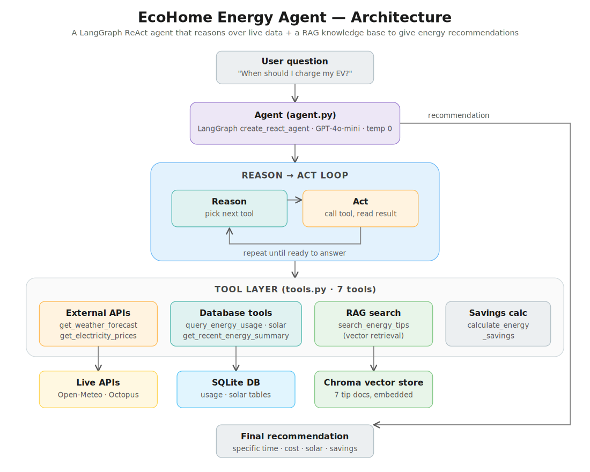
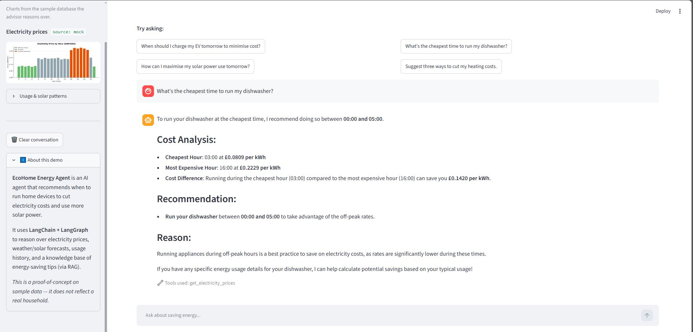

# ⚡ EcoHome Energy Agent

An AI agent that tells you **when to run your home devices** — your EV, dishwasher,
heating, pool pump — to **minimise electricity costs** and **make the most of your
solar power**. Built with **LangChain + LangGraph**, it reasons over live electricity
prices, weather/solar forecasts, your usage history, and a knowledge base of
energy-saving best practices, then gives a specific, data-backed recommendation.

> **Note:** This is a portfolio / learning project. It runs on **sample data**, so
> recommendations illustrate the capability rather than reflecting a real household.

---

## What it does

Ask a question like *"When should I charge my EV tomorrow to minimise cost and
maximise solar power?"* and the agent will:

1. Work out which devices, timeframe, and goal are involved.
2. Gather the data it needs — electricity prices, the weather/solar forecast, and
   your past usage — by calling its tools.
3. Retrieve relevant energy-saving tips from a knowledge base (RAG).
4. Calculate the potential savings.
5. Return a clear recommendation: a **specific time window**, a **cost analysis**,
   a **solar consideration**, and a **savings estimate**.

---

## Architecture

The agent is a **LangGraph ReAct loop**: the LLM reasons about what it needs, calls a
tool, reads the result, and repeats until it can answer. All the capability lives in
seven tools; the data lives in a SQLite database and a Chroma vector store.



| Layer | What it is |
|-------|------------|
| **Agent** (`agent.py`) | LangGraph `create_react_agent`, GPT-4o-mini, temperature 0 |
| **Tools** (`tools.py`) | 7 tools: 2 external-API (weather, pricing), 3 database, 1 RAG search, 1 savings calculator |
| **External APIs** | Real **Open-Meteo** (weather + solar irradiance) and **Octopus Agile** (UK electricity prices), each with a mock fallback |
| **Database** | SQLite with energy-usage and solar-generation tables |
| **Knowledge base** | Chroma vector store over 7 energy-saving documents |

---

## Project structure

```
ecohome_solution/
├── models/
│   ├── __init__.py
│   └── energy.py              # SQLAlchemy models + DatabaseManager
├── data/
│   ├── documents/             # 7 energy-saving knowledge-base docs (.txt)
│   ├── energy_data.db         # created by 01_db_setup.ipynb
│   └── vectorstore/           # created by 02_rag_setup.ipynb
├── agent.py                   # the LangGraph agent
├── tools.py                   # the 7 agent tools
├── visualizations.py          # chart helpers (for the app + report)
├── app.py                     # Streamlit demo app
├── smoke_test.py              # end-to-end check script
├── requirements.txt           # verified working dependencies
├── 01_db_setup.ipynb          # build + populate the database
├── 02_rag_setup.ipynb         # build the RAG vector store
├── 03_run_and_evaluate.ipynb  # run the agent + full evaluation
└── README.md
```

---

## Setup

**Python 3.11 recommended.**

### 1. Install dependencies

```bash
pip install -r requirements.txt
```

### 2. Add your OpenAI API key

Create a `.env` file in the project root (next to `agent.py`):

```
OPENAI_API_KEY=sk-your-key-here
```

### 3. Build the data stores (run once, in order)

1. Run **`01_db_setup.ipynb`** — creates and populates `data/energy_data.db`.
2. Run **`02_rag_setup.ipynb`** — embeds the documents into `data/vectorstore/`.

### 4. Verify everything works

```bash
python smoke_test.py
```

This checks each layer end-to-end (env → APIs → database → RAG → agent → evaluation)
and reports exactly where any problem is.

### 5. Run the agent + evaluation

Open **`03_run_and_evaluate.ipynb`** and run all cells. It runs the agent across 12
test cases and produces a full evaluation report (response quality + tool usage).

---

## Try the interactive demo

A small **Streamlit app** wraps the same agent in a chat interface, with live charts
of the underlying data in the sidebar:

```bash
streamlit run app.py
```

It opens in your browser at `localhost:8501`. Ask questions, see which tools the
agent calls, and explore the price/usage/solar charts.



*The agent recommends a specific off-peak window with a full cost breakdown, and
the "Tools used" line shows it called a real tool to ground its answer.*
---

## How it's evaluated

`03_run_and_evaluate.ipynb` evaluates the agent on two axes:

- **Response quality** — accuracy, relevance, completeness, usefulness, scored by an
  LLM-as-judge (with a rule-based fallback if no API is available).
- **Tool usage** — whether the agent called the *right* tools (appropriateness) and
  *all* the needed tools (completeness), scored with set comparisons against the
  expected tools for each test case.

A report aggregates these into overall scores, identifies strengths and weaknesses
(including catching inconsistent metrics that a simple average would hide), and
generates improvement recommendations.

---

## Troubleshooting

These are real issues encountered setting up on **Windows + Anaconda**, with fixes:

| Symptom | Cause & fix |
|---------|-------------|
| `ModuleNotFoundError: No module named 'langchain.text_splitter'` | Modern LangChain split this out. Use `from langchain_text_splitters import RecursiveCharacterTextSplitter`. |
| RAG step **crashes silently** (process exits with no error) when loading the vector store | `chromadb` needs **`onnxruntime`** on Windows. `pip install onnxruntime`. |
| `OMP: Error #15: ...libiomp5md.dll already initialized` | Duplicate OpenMP runtime (common in Anaconda). Set `os.environ["KMP_DUPLICATE_LIB_OK"] = "TRUE"` at the very top of the script, before other imports. (Already handled in `app.py`.) |
| `Missing credentials ... OPENAI_API_KEY` even though `.env` exists | The code that runs must call `load_dotenv()`. Make sure you run from the project root so `.env` is found. |
| `no such table: energy_usage` | Run `01_db_setup.ipynb` first to create the database. |
| `splits: 0` / empty embeddings when building the store | The `.txt` documents must be in `data/documents/`. The loader globs that folder. |
| Notebook can't find installed packages | VS Code may be using a different kernel than your terminal. Set the notebook's kernel to the same Python environment where you installed the packages. |
| Can't delete `data/vectorstore/` ("file in use") | A notebook kernel is holding it open. Close the notebooks (shuts down kernels), then delete. |

> **Tip:** if you rebuild the knowledge base after adding documents, delete the
> existing `data/vectorstore/` folder first so it rebuilds with all the documents
> (the store is cached and won't rebuild if it already exists).

---

## Key technologies

**LangChain** · **LangGraph** (ReAct agent) · **ChromaDB** (vector store / RAG) ·
**OpenAI** (LLM + embeddings) · **SQLAlchemy** + **SQLite** · **Streamlit** (demo app) ·
**matplotlib** (visualizations)

---

## License

Educational / portfolio project.
